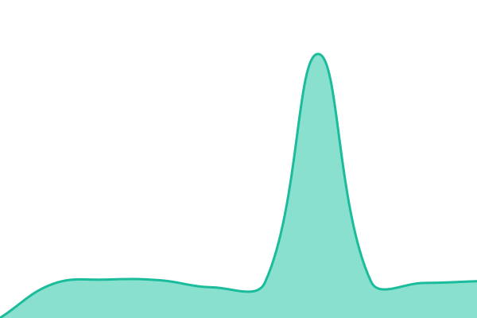

# [📈 Live Status](https://DARKDRAGON-LK.github.io/ServerMonitor): <!--live status--> **🟧 Partial outage**

This repository contains the open-source uptime monitor and status page for [Lawan Chaamindu Jayalath Samarasekara](lawanchaamindu.live), powered by [Upptime](https://github.com/upptime/upptime).

With [Upptime](https://upptime.js.org), you can get your own unlimited and free uptime monitor and status page, powered entirely by a GitHub repository. We use [Issues](https://github.com/DARKDRAGON-LK/ServerMonitor/issues) as incident reports, [Actions](https://github.com/DARKDRAGON-LK/ServerMonitor/actions) as uptime monitors, and [Pages](https://DARKDRAGON-LK.github.io/ServerMonitor) for the status page.

<!--start: status pages-->
<!-- This summary is generated by Upptime (https://github.com/upptime/upptime) -->
<!-- Do not edit this manually, your changes will be overwritten -->
<!-- prettier-ignore -->
| URL | Status | History | Response Time | Uptime |
| --- | ------ | ------- | ------------- | ------ |
|  Coop | 🟥 Down | [coop.yml](https://github.com/DARKDRAGON-LK/ServerMonitor/commits/HEAD/history/coop.yml) | 

 5081ms
     
 | 

<a href="https://DARKDRAGON-LK.github.io/ServerMonitor/history/coop">99.99%</a>
    

|  Southern Lanka | 🟩 Up | [southern-lanka.yml](https://github.com/DARKDRAGON-LK/ServerMonitor/commits/HEAD/history/southern-lanka.yml) | 

 2603ms
     
 | 

<a href="https://DARKDRAGON-LK.github.io/ServerMonitor/history/southern-lanka">100.00%</a>
    

|  Ruhunu | 🟩 Up | [ruhunu.yml](https://github.com/DARKDRAGON-LK/ServerMonitor/commits/HEAD/history/ruhunu.yml) | 

 2550ms
     
 | 

<a href="https://DARKDRAGON-LK.github.io/ServerMonitor/history/ruhunu">99.60%</a>
    

|  Ruhunu Medi House | 🟩 Up | [ruhunu-medi-house.yml](https://github.com/DARKDRAGON-LK/ServerMonitor/commits/HEAD/history/ruhunu-medi-house.yml) | 

 2386ms
     
 | 

<a href="https://DARKDRAGON-LK.github.io/ServerMonitor/history/ruhunu-medi-house">99.60%</a>
    

|  Digasiri | 🟩 Up | [digasiri.yml](https://github.com/DARKDRAGON-LK/ServerMonitor/commits/HEAD/history/digasiri.yml) | 

 3187ms
     
 | 

<a href="https://DARKDRAGON-LK.github.io/ServerMonitor/history/digasiri">100.00%</a>
    

|  Horizon | 🟩 Up | [horizon.yml](https://github.com/DARKDRAGON-LK/ServerMonitor/commits/HEAD/history/horizon.yml) | 

 3367ms
     
 | 

<a href="https://DARKDRAGON-LK.github.io/ServerMonitor/history/horizon">99.63%</a>
    

|  Mathara Pharmacy | 🟩 Up | [mathara-pharmacy.yml](https://github.com/DARKDRAGON-LK/ServerMonitor/commits/HEAD/history/mathara-pharmacy.yml) | 

 2417ms
     
 | 

<a href="https://DARKDRAGON-LK.github.io/ServerMonitor/history/mathara-pharmacy">99.60%</a>
    

|  Engage Wellness Center | 🟩 Up | [engage-wellness-center.yml](https://github.com/DARKDRAGON-LK/ServerMonitor/commits/HEAD/history/engage-wellness-center.yml) | 

 2616ms
     
 | 

<a href="https://DARKDRAGON-LK.github.io/ServerMonitor/history/engage-wellness-center">100.00%</a>
    

|  UCFM | 🟥 Down | [ucfm.yml](https://github.com/DARKDRAGON-LK/ServerMonitor/commits/HEAD/history/ucfm.yml) | 

 1516ms
     
 | 

<a href="https://DARKDRAGON-LK.github.io/ServerMonitor/history/ucfm">0.00%</a>
    

|  Kagalu Medhi Lab | 🟥 Down | [kagalu-medhi-lab.yml](https://github.com/DARKDRAGON-LK/ServerMonitor/commits/HEAD/history/kagalu-medhi-lab.yml) | 

 1260ms
     
 | 

<a href="https://DARKDRAGON-LK.github.io/ServerMonitor/history/kagalu-medhi-lab">0.00%</a>
    

<!--end: status pages-->

[**Visit our status website →**](https://DARKDRAGON-LK.github.io/ServerMonitor)

## 📄 License

- Powered by: [Upptime](https://github.com/upptime/upptime)
- Code: [MIT](./LICENSE) © [Anand Chowdhary](https://anandchowdhary.com), supported by [Pabio](https://pabio.com)
- Data in the `./history` directory: [Open Database License](https://opendatacommons.org/licenses/odbl/1-0/)
